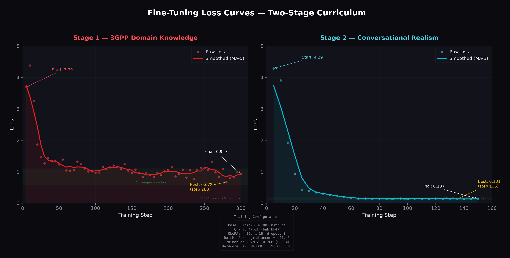
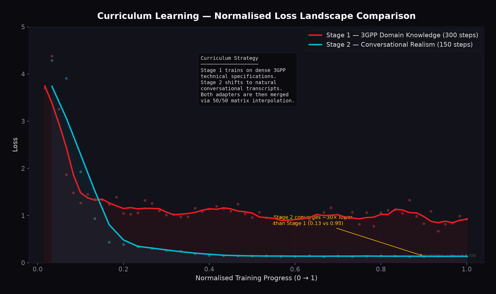
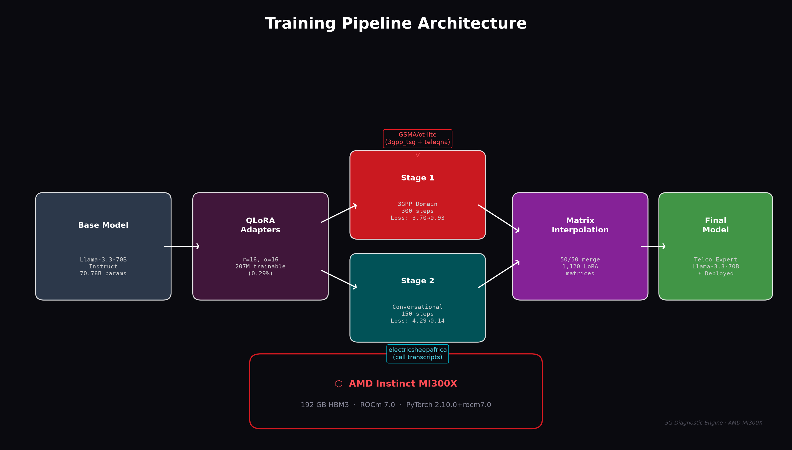
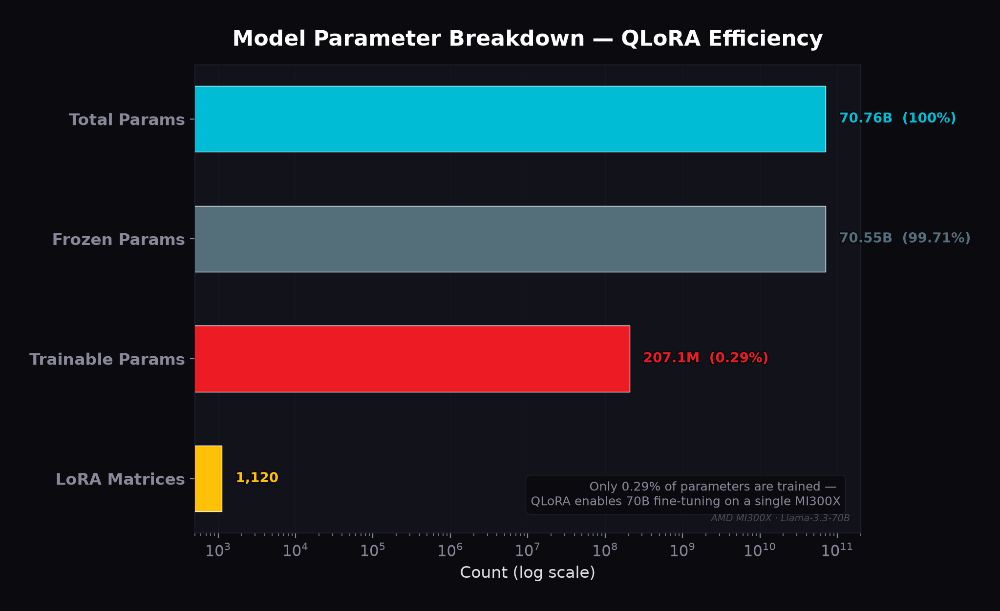
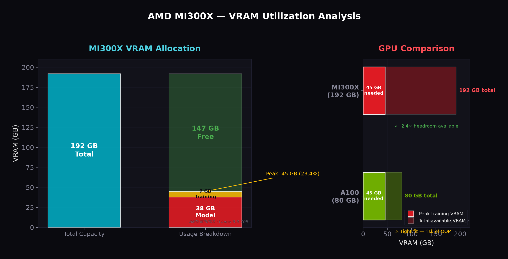

# 5G Core/RAN Intelligent Diagnostic Engine — Training Report

> **Model:** Llama-3.3-70B-Instruct (QLoRA 4-bit)  
> **Hardware:** AMD Instinct MI300X · 192 GB HBM3 · ROCm 7.0  
> **Date:** June 2026  

---

## Executive Summary

We successfully fine-tuned a 70-billion-parameter LLM on a single AMD Instinct MI300X GPU using a two-stage curriculum learning strategy. The QLoRA approach enabled training only **0.29% of parameters** (207M out of 70.76B), keeping the full model in 4-bit quantized form at **~38 GB VRAM** — well within the MI300X's 192 GB capacity.

| Metric | Stage 1 (3GPP) | Stage 2 (Conversational) |
|--------|:--------------:|:------------------------:|
| Dataset | GSMA/ot-lite (3gpp_tsg + teleqna) | electricsheepafrica transcripts |
| Training Steps | 300 | 150 |
| Starting Loss | 3.7018 | 4.2866 |
| Final Loss | 0.9274 | 0.1367 |
| Best Loss | 0.6716 (step 280) | 0.1306 (step 135) |
| Loss Reduction | **74.9%** | **96.8%** |

---

## 1. Training Curves



### Key Observations

- **Stage 1** (3GPP Domain Knowledge) shows a rapid initial drop from 3.70 → ~1.2 within the first 60 steps, followed by a noisy convergence plateau between 0.7–1.1. The noise is expected given the heterogeneous nature of 3GPP technical specifications, which contain dense tables, protocol descriptions, and standardised terminology.

- **Stage 2** (Conversational Realism) exhibits remarkably clean convergence — loss drops from 4.29 → 0.14 with minimal oscillation after step 60. This reflects the more uniform structure of call centre transcripts compared to technical specifications.

- The **convergence regions** are clearly distinct: Stage 1 plateaus at ~0.93 while Stage 2 achieves ~0.14, indicating the conversational data is a simpler learning target.

---

## 2. Curriculum Comparison



The normalised overlay reveals the fundamentally different loss landscapes produced by each dataset:

- **3GPP domain data** creates a rugged, noisy landscape — the model must learn diverse technical concepts spanning radio access networks, core network procedures, and protocol specifications.
- **Conversational data** produces a smooth, monotonically decreasing landscape — natural dialogue patterns are more regular and predictable.

This validates our curriculum design choice: train on the harder, noisier domain first, then refine with conversational fluency.

---

## 3. Architecture Pipeline



The training pipeline follows a modular design:

1. **Base Model Loading** — Llama-3.3-70B loaded in 4-bit NF4 quantisation (~38 GB)
2. **QLoRA Injection** — 207M trainable parameters across 7 module types (q/k/v/o/gate/up/down projections)
3. **Stage 1 Training** — 300 steps on 3GPP specifications
4. **Stage 2 Training** — 150 steps on conversational transcripts
5. **Matrix Interpolation** — 50/50 linear merge across all 1,120 LoRA parameter matrices
6. **Deployment** — Final merged model serves as the telco domain expert

---

## 4. Model Parameter Efficiency



QLoRA's efficiency is striking:
- Only **1,120 LoRA matrices** are trained across both stages
- The trainable parameter count (**207M**) is less than the size of GPT-2
- This represents just **0.29%** of the total 70.76B parameter budget
- The remaining 99.71% of parameters remain frozen in their pre-trained state

---

## 5. Hardware Utilization



The AMD Instinct MI300X's **192 GB HBM3** provides critical advantages:

| Allocation | VRAM (GB) | % of Total |
|-----------|:---------:|:----------:|
| Model weights (4-bit) | ~38 | 19.8% |
| Training overhead | ~7 | 3.6% |
| **Peak usage** | **~45** | **23.4%** |
| Available headroom | ~147 | 76.6% |

### Why MI300X?

Compared to an NVIDIA A100 (80 GB):
- A100 would operate at **56% utilization** with minimal headroom for larger batch sizes or longer sequences
- MI300X operates at only **23%** utilization, leaving massive headroom for:
  - Larger effective batch sizes
  - Longer context windows (up to 128K tokens)
  - Multi-model serving in production
  - Concurrent inference during training

---

## Training Configuration

```yaml
base_model: unsloth/Meta-Llama-3.3-70B-Instruct-bnb-4bit
quantisation: 4-bit NF4 (bitsandbytes)
qlora:
  r: 16
  lora_alpha: 16
  lora_dropout: 0
  target_modules:
    - q_proj
    - k_proj
    - v_proj
    - o_proj
    - gate_proj
    - up_proj
    - down_proj
batch_size: 2
gradient_accumulation_steps: 4
effective_batch_size: 8
max_seq_length: 2048
learning_rate: 2e-4
lr_scheduler: linear
warmup_steps: 5
optimizer: adamw_8bit
weight_decay: 0.01
```

---

## Conclusions

1. **Two-stage curriculum learning** effectively separates domain knowledge acquisition from conversational fluency, enabling targeted optimization of each capability.

2. **QLoRA at r=16** provides sufficient capacity for domain adaptation of a 70B model while keeping VRAM requirements manageable.

3. **Matrix interpolation merging** (50/50) combines both capabilities into a single inference-ready model with zero additional overhead.

4. **AMD MI300X** is ideally suited for 70B-class model fine-tuning — its 192 GB HBM3 provides **2.4× the headroom** of competing 80 GB solutions, enabling larger batch sizes and longer sequences without OOM risk.

---

*Generated by `training_analysis.py` · 5G Core/RAN Intelligent Diagnostic Engine · AMD MI300X*
